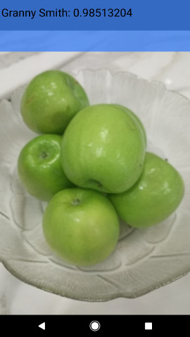

# TensorFlow Android Boiler Plate

This folder contains an example application utilizing TensorFlow for Android
devices.

## Description

The demos in this folder are designed to give straightforward samples of using
TensorFlow in mobile applications.

Inference is done using the [TensorFlow Android Inference
Interface](../../../tensorflow/contrib/android), which may be built separately
if you want a standalone library to drop into your existing application. Object
tracking and efficient YUV -> RGB conversion are handled by
`libtensorflow_demo.so`.

A device running Android 5.0 (API 21) or higher is required to run the demo due
to the use of the camera2 API, although the native libraries themselves can run
on API >= 14 devices.

## Current samples:

1. [TF Classify](https://github.com/tensorflow/tensorflow/blob/master/tensorflow/examples/android/src/org/tensorflow/demo/ClassifierActivity.java):
        Uses the [Google Inception](https://arxiv.org/abs/1409.4842)
        model to classify camera frames in real-time, displaying the top results
        in an overlay on the camera image.
2. [TF Detect](https://github.com/tensorflow/tensorflow/blob/master/tensorflow/examples/android/src/org/tensorflow/demo/DetectorActivity.java):
        Demonstrates an SSD-Mobilenet model trained using the
        [Tensorflow Object Detection API](https://github.com/tensorflow/models/tree/master/research/object_detection/)
        introduced in [Speed/accuracy trade-offs for modern convolutional object detectors](https://arxiv.org/abs/1611.10012) to
        localize and track objects (from 80 categories) in the camera preview
        in real-time.
3. [TF Stylize](https://github.com/tensorflow/tensorflow/blob/master/tensorflow/examples/android/src/org/tensorflow/demo/StylizeActivity.java):
        Uses a model based on [A Learned Representation For Artistic
        Style](https://arxiv.org/abs/1610.07629) to restyle the camera preview
        image to that of a number of different artists.
4.  [TF
    Speech](https://github.com/tensorflow/tensorflow/blob/master/tensorflow/examples/android/src/org/tensorflow/demo/SpeechActivity.java):
    Runs a simple speech recognition model built by the [audio training
    tutorial](https://www.tensorflow.org/versions/master/tutorials/audio_recognition). Listens
    for a small set of words, and highlights them in the UI when they are
    recognized.



## Prebuilt Components:

The fastest path to trying the demo is to download the [prebuilt demo APK](http://download.tensorflow.org/deps/tflite/TfLiteCameraDemo.apk).

Also available are precompiled native libraries, and a jcenter package that you
may simply drop into your own applications. See
[tensorflow/contrib/android/README.md](../../../tensorflow/contrib/android/README.md)
for more details.

## Running the Demo

Once the app is installed it can be started via the "TF Classify", "TF Detect",
"TF Stylize", and "TF Speech" icons, which have the orange TensorFlow logo as
their icon.

While running the activities, pressing the volume keys on your device will
toggle debug visualizations on/off, rendering additional info to the screen that
may be useful for development purposes.

## Building in Android Studio using the TensorFlow AAR from JCenter

The simplest way to compile the demo app yourself, and try out changes to the
project code is to use AndroidStudio. Simply set this `android` directory as the
project root.

Then edit the `build.gradle` file and change the value of `nativeBuildSystem` to
`'none'` so that the project is built in the simplest way possible:

```None
def nativeBuildSystem = 'none'
```

While this project includes full build integration for TensorFlow, this setting
disables it, and uses the TensorFlow Inference Interface package from JCenter.

Note: Currently, in this build mode, YUV -> RGB is done using a less efficient
Java implementation, and object tracking is not available in the "TF Detect"
activity. Setting the build system to `'cmake'` currently only builds
`libtensorflow_demo.so`, which provides fast YUV -> RGB conversion and object
tracking, while still acquiring TensorFlow support via the downloaded AAR, so it
may be a lightweight way to enable these features.

For any project that does not include custom low level TensorFlow code, this is
likely sufficient.

For details on how to include this JCenter package in your own project see
[tensorflow/contrib/android/README.md](../../../tensorflow/contrib/android/README.md)

## Building the Demo with TensorFlow from Source

Pick your preferred approach below. At the moment, we have full support for
Bazel, and partial support for gradle, cmake, make, and Android Studio.

As a first step for all build types, clone the TensorFlow repo with:

```
git clone --recurse-submodules https://github.com/tensorflow/tensorflow.git
```

Note that `--recurse-submodules` is necessary to prevent some issues with
protobuf compilation.

